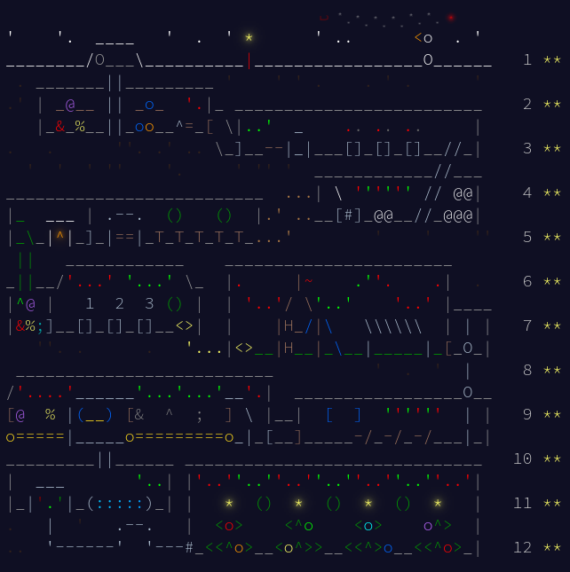

# [Advent of code 2025](https://adventofcode.com/2025) (Golang)

- `main.go`: entry point
- `io/`: utilities to read input files
- `days/`: solutions for each day
- `dataStructures/`: data structures used for the solutions
- `inputFiles/`: input files (excluded from the repo)

## Running solutions

```bash
go run main.go day<dayNumber> runs the specific day

go run main.go day<dayNumber>Part<partNumber> runs the specific part of the day

go run main.go all runs all days
```
---

